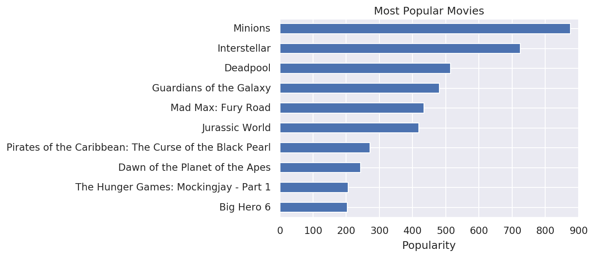
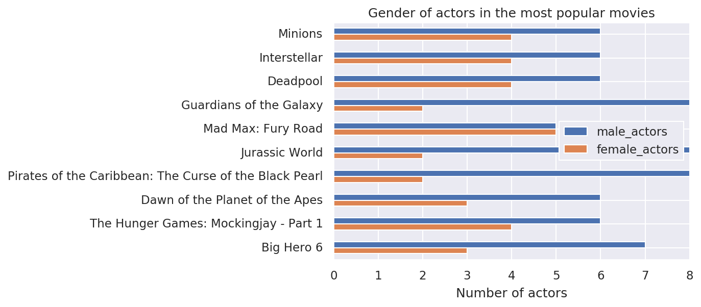
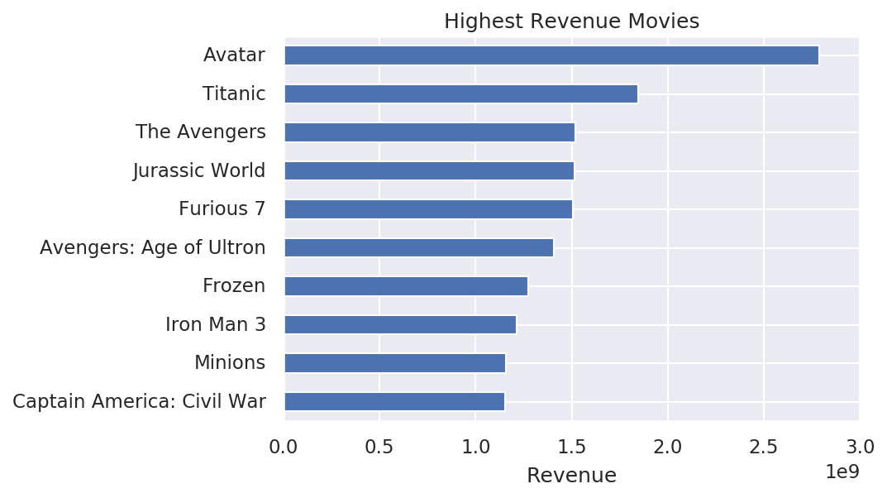
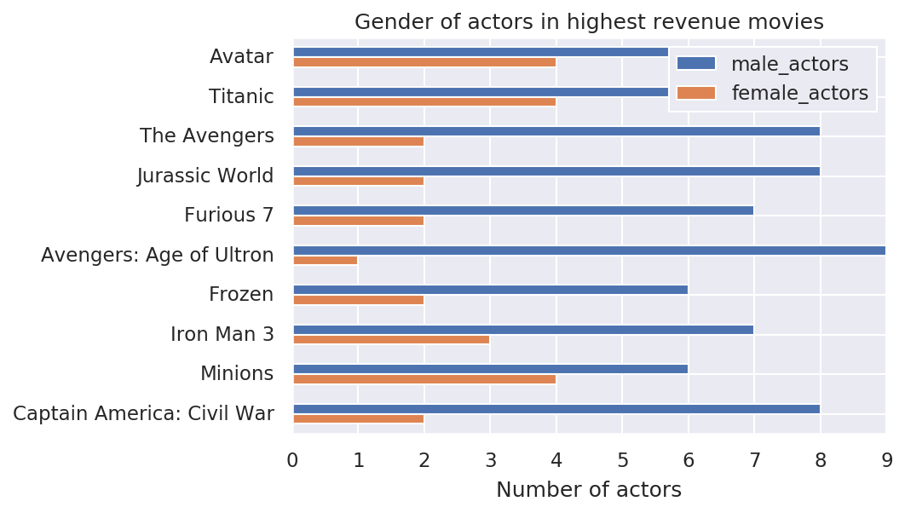
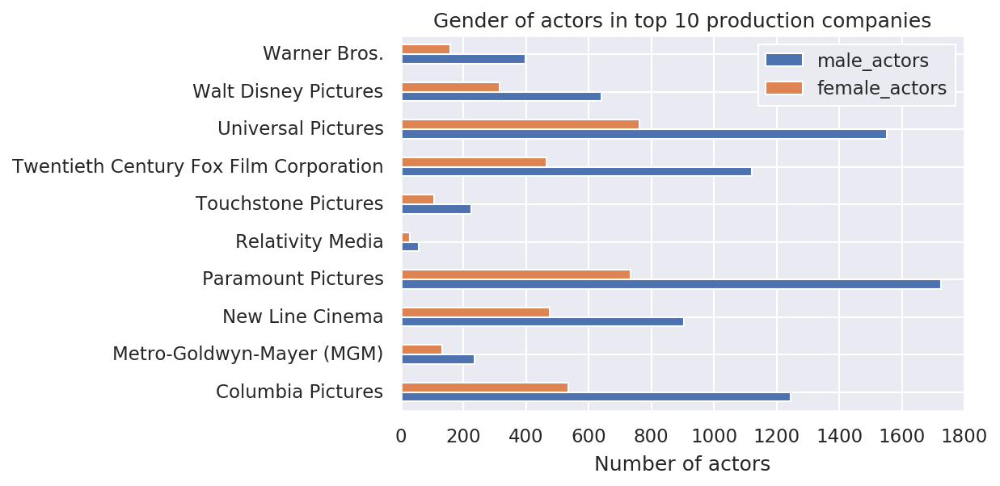
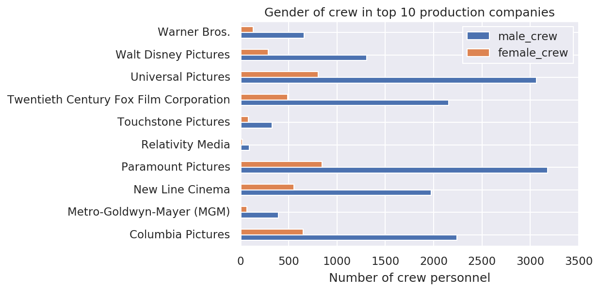
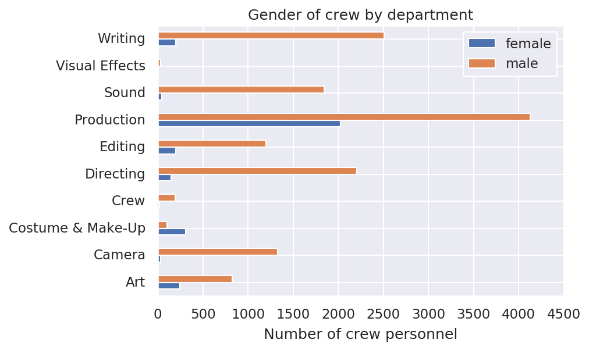

# Project of Data Visualization (COM-480)

| Student's name | SCIPER |
| -------------- | ------ |
| Blagoj Mitrevski | 295003 |
| Martin Milenkoski | 295000 |
| Mladen Korunoski | 309531 |

[Milestone 1](#milestone-1-friday-3rd-april-5pm) • [Milestone 2](#milestone-2-friday-1st-may-5pm) • [Milestone 3](#milestone-3-thursday-28th-may-5pm)

## Milestone 1 (Friday 3rd April, 5pm)

**10% of the final grade**

### 1.1 Dataset

For this project, we are using the [TMDb 5000 Movie Dataset](https://www.kaggle.com/tmdb/tmdb-movie-metadata), a metadata for around 5000 movies from TMDb. It contains two data sources: for *movies* and *credits*. The *movies* dataset has more columns (20) than the credits (4). The sources are in CSV format, however many of the cells contain JSON objects. For that, we need to parse the values and produce normalised tables. Most of the data, relevant for this study, is contained in the JSON objects, so we can safely discard any missing values. We plan to generate the necessary files for our visualisations (ex. with Pandas) and directly handle them with D3.

The *credits* dataset, although narrower, has most of the relevant data for this study. In the `cast` column, for each movie we have a list of characters and the actors portraying them, alongside personal information, such as `gender`. They are sorted depending on the role: main, supporting, etc. The `crew` column contains similar data, but regarding the crew members for a particular movie. They are also sorted in the same way they appear on the credits screen. The *movies* dataset has data for `genres`, `keywords`, `language`, `production`, etc. They are presented as arrays that we could aggregate. There are several numerical columns, such as: `budget`, `popularity`, `runtime`, and `vote` that we could incorporate in our study.

A lot of info can be inferred from the data. For example, we could infer the movie category from the crew's job title. Also, we could use the TMDb's API to further enrich the data.

Overall the data is pretty clean and ready for processing.

### 1.2 Problematic

The main axis we want to explore is gender equality along different dimensions. Some example questions we are interested in are:

 - Does gender equality improve over time?
 - What is the state of the gender distribution in different movie genres?
 - What is the state of the gender distribution in different countries?
 - Are there some production companies that are biased towards casting actors from a particular gender?
 - Are there directors who prefer working with male or female actors? 
 - Are there clusters of actors and directors who often work together?
 - Does the popularity/rating of a movie depend on the gender of the leading actor?

There has been a big movement towards gender equality in Hollywood in recent years, so we believe that our project will answer some interesting questions for the movie audience and the general public.

Apart from gender equality, we plan to also explore the other dimensions of the data and look for interesting patterns that we can show through a visualization. 

### 1.3 Exploratory Data Analysis

The dataset contains metadata for 4 803 movies including metadata for the actors and the crew of the movies. For the actors, there is metadata for a total of 48 291 male actors, and 24 168 female actors. Similarly, for the crew there is metadata for a total of 43 000 male crew personnel, and 11 764 female personnel. We created a few plots to get more insight in the data, and see if there is enough information to answer our questions.

This word cloud plot is a visual representation of the movie genres in our dataset. The most common movie genres are comedy, drama, thriller, action, etc.

  

From these two plots we can see the ten most popular movies, and the gender representation in these movies. As we can see from the second plot, in all the movies there are more actors than actresses.

  

  

From these two plots we can see the ten movies with highest revenue, and the gender representation in these movies. Similarly as with the most popular movies, in all the movies there are more actors than actresses.

  

  

We also investigated the gender distribution in the top ten production companies. Here again we clearly see an overrepresentation of the actors over the actresses.

  

As the next plot shows, the similar trend is also observed in the gender distribution of the crew in the top ten production companies.

  

Finally, we looked at the gender distribution of the crew by departments in the movie industry. Here, we see that the male crew members are overrepresented in all the departments, except the costume and makeup department where we see more female crew members.

  

These results are strong enough to point us to a conclusion that there is gender bias in Hollywood and the movie industry in general. This gives us an additional motivation to further investigate gender bias, and the recent movement towards gender equality in Hollywood.

### 1.4 Related work

The dataset is published on Kaggle, and there are around 1,500 kernels related to it. The authors of these kernels explore many different topics and dimensions of the dataset. Some popular topics include exploratory data analysis, recommendation engines, rating prediction and many others. As an example, in this [Kaggle kernel](https://www.kaggle.com/gsdeepakkumar/movie-mania-exploring-the-movie-database) we found various visualizations exploring this dataset. The kernel includes visualizations about popularity of the movies, most common keywords, correlations between popularity and revenue, etc. 

However, to the best of our knowledge, there is no kernel that explores the gender inequality and the questions we are interested in. Moreover, the kernels at Kaggle are static notebooks that lack interactivity. Therefore, our approach is unique in the sense that it will address an unexplored dimension of the dataset, and it will also provide more interactive visualizations using D3.js.

One interesting source of inspiration is [this](https://www.theatlantic.com/business/archive/2018/01/the-brutal-math-of-gender-inequality-in-hollywood/550232/) article that addresses the issue of underrepresentation of women in key behind-the-camera roles. The article also contains a visualization to support its claims. As mentioned before, we would like to create more thorough analysis of this phenomenon supported by more interactive and better visualizations. 

Another source of inspiration was [this](https://exploringcomics.github.io/src/app/index.html?fbclid=IwAR0frEn46nzQFLah-BOkK7qGuKagq2uUa6IRhM9y3SjrinzpZ77cHs2eCpU) project from the last year's course. The project contains some very interesting visualizations that explore the diversity in comics. This inspired us to look into gender diversity in movies. 

## Milestone 2 (Friday 1st May, 5pm)

**10% of the final grade**

Our project description for Milestone 2 can be found [here](https://github.com/com-480-data-visualization/com-480-project-tissot/blob/master/Milestone%202.pdf).

Our initial website can be accessed on this [link](https://com-480-data-visualization.github.io/com-480-project-tissot/).

## Milestone 3 (Thursday 28th May, 5pm)

**80% of the final grade**

### Deliverables

You can access our visualization [here](https://com-480-data-visualization.github.io/com-480-project-tissot/).

You can watch our screencast [here](https://www.youtube.com/watch?v=6XnMwf_IjUo).

You can read our process book [here](https://github.com/com-480-data-visualization/com-480-project-tissot/blob/master/Gender%20in%20Movies%20-%20Process%20Book.pdf).

### Visualization

In the visualization you can choose a year using the slider at the bottom. The dashboard will be updated with the data from that year. 

On the visualization on the left you can see all the movies from the selected year. The x axis shows the movie budget, the y axis shows the movie revenue, the size of the circle shows the popularity and the color shows the gender of the main actor. Actors are shown in blue and actresses are shown in red. You can choose to color the circles by the gender of the director using the button at the bottom left. You can hover over a movie to see its name and click on it to see more details about the movie. In this view, clicking on the name of the main actor or director will highlight them in the network visualization on the right.

On the visuazalition on the top right you can see a network of collaborations between actors and directors. Directors are shown with chair icons and actors are shown with user icons with little stars. Males are colored in blue and females in red. You can use the search bar on the top left to find and highlight a specific person. Using the buttons at the bottom left you can show or hide specific types of nodes. Hovering over a node will show the role and name of the person. Clicking on the node will show the detailed view for the person and highlight their movies on the left visualization.

On the visualization on the bottom right you can see a stacked bar chart. Here, you can view the representation of male and female leading stars in different genres. Blue is used for males and red for females. You can choose to see the representation of directors using the button on the bottom left. Hovering over a bar will show the exact percentage and clicking on it will show the 5 most popular movies in that category. Clicking on a movie poster in this view will highlight the movie on the left visualization, and double clicking will open the detailed view for that movie.

### Project structure

You can find the code and data for our website in the `docs` folder. This folder contains the files `index.html` and `styles.css` used for creating and styling our web page. Additionally, it contains the font we use for the title and the icons we use in the visualizations. 

The individual datasets used in the final visualizations can be found in the folder `docs/data`. 

The folder `docs/src` contains two javascript files: 

- `index.js` - this file contains the implementation of our dashboard functionalitites.
- `themoviedb.js` - this file contains the code from themoviedb.js library that can be found in this [repository](https://github.com/cavestri/themoviedb-javascript-library). We did some slight modifications of the library for our needs.

In the folder `notebooks` you can find two notebooks:

- `Data Filtering.ipynb` - used for filtering the crawled data and creating the dataset of 100k movies.
- `Final Datasets Generation.ipynb` - used for generating the individual datasets used in our visualizations.

### Data

The crawled TMDB data is stored in 7 partitions, with two tables per partition:
- [Movies](https://drive.google.com/file/d/19OisQTXlxDY1RjKDj4kOe_j4Phu3HDdO/view?usp=sharing)
- [Credits](https://drive.google.com/file/d/1tDah9EoY9FVZgaFtRKWk5zpdUP5Z_-ft/view?usp=sharing)

After filtering, we have close to 500k movies in our initial [dataset](https://drive.google.com/file/d/14Utozg-lNKqXqBYmJLLvXtf3YmTwSpJj/view?usp=sharing).
However, many of them are for adults, so we created additional [table](https://drive.google.com/file/d/1zvoQmKK0Ryd4d-32ElqsvhjczchWF5b6/view?usp=sharing) that indicates this.
After joining the last two tables and filtering out movies that are for adults, we are left with 100k movies in our [dataset](https://drive.google.com/file/d/1OzaZ_Ad2-_lOwwGvOGwXJ7or9DOlm9NU/view?usp=sharing).

Finally, we processed the dataset to create the individual datasets used in our visualizations. These datasets can be found in the folder `docs/data`.
